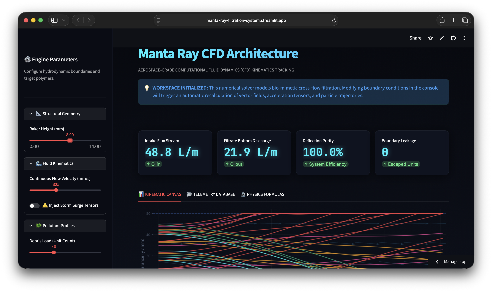

# 🌌 Manta Ray CFD Architecture

**Aerospace-Grade Kinematics Tracking for Bio-Mimetic Microplastic Filtration**


*(Live Stardance Submission Dashboard - Real-time Kinematic Canvas)*

## 🚀 The Vision
Oceanic microplastic pollution requires scalable, non-clogging filtration mechanisms. Nature has already solved this: **Manta rays use cross-flow filtration and gill rakers to separate plankton from seawater without ever clogging.** The **Manta Ray CFD Architecture** is a high-fidelity Python web engine that digitizes and models this exact bio-mimetic process. Built for the Stardance competition, this platform calculates fluid kinematics, volumetric flux, and localized drag forces to simulate how different classifications of microplastics are deflected by structural boundaries.

## 🧬 Core Simulation Engine & Physics

The engine doesn't just draw lines; it tracks discrete polymer masses against continuous fluid dynamics. The mathematical solver evaluates real-world physics at every time step:

### Volumetric Flux
The system maintains mass continuity by evaluating fluid flux over the designated cross-sectional area:
$$Q_{intake} = A_{channel} \cdot v_{flow}$$

### Transport Kinematics
Individual particle trajectories are calculated through a dynamic balance of buoyancy and drag forces acting on localized plastic masses. When a particle encounters the structural slopes of the "gill rakers," reflection algorithms invert vertical acceleration layers to simulate cross-flow shear:
$$a_{buoyancy} = \left(\frac{\rho_{polymer} - \rho_{fluid}}{\rho_{polymer}}\right) \cdot g$$

$$F_{drag} = -\frac{1}{2} C_d \cdot \rho_{fluid} \cdot A_{cross} \cdot v_{relative} \cdot |v_{relative}|$$

## 🛠️ Enterprise-Grade Features

* **Dynamic Boundary Layer Tracking:** Real-time visualization of particle shear vector reflections across 5 unique geometric raker slopes.
* **Polymer Mass Profiling:** Simulates exact volumetric bulk densities for PP, LDPE, PS, PET, and PVC to track how different plastics react to identical fluid currents.
* **Storm Surge Tensors:** A toggleable stress-test mode that injects chaotic velocity tensors and random acceleration noise into the fluid grid.
* **Live Telemetry Database:** An automated background logger that traces and records parametric sweep variables (Intake Flux, Deflection Purity, Boundary Leakage) into a persistent session state.

## 💻 Tech Stack
* **Backend Physics Engine:** Pure `Python 3` (Vector Mathematics, Kinematic Loops)
* **Frontend Architecture:** `Streamlit` (Custom Glassmorphism UI, Wide-Layout HUD)
* **Data Visualization:** `Matplotlib` (Transparent HUD Canvas Rendering)
* **Data Logging:** `Pandas` (Real-time telemetry trace formatting)

## ⚙️ Quick Start (Run Locally)

Follow these steps to deploy and run the simulation engine on your local machine:

**1. Clone the repository and navigate into the folder:**
```bash
git clone https://github.com/prajith-vishnu/manta-ray-filtration-system.git
cd manta-ray-filtration-system
```

**2. Install all the required Python libraries:**
```bash
pip install streamlit matplotlib pandas
```

**3. Launch the local Streamlit server to boot the workspace:**
```bash
streamlit run web_app.py
```

---
## 🤖 AI Attribution and Usage Declaration
In accordance with responsible engineering practices and modern research transparency guidelines, this project utilizes a collaborative human-AI development framework.

👤 Human Author Contributions
Core Physics Formulation: Formulated, derived, and verified the underlying Lagrangian kinematic force equations, specular wall-normal reflection rules, and boundary condition limits.

Experimental Methodology: Designed the independent/dependent variable matrices (raker angle vs. deflection performance) and structured the multi-week biofouling degradation index.
System Design Requirements: Engineered the spatial boundary thresholds, statistical error frameworks, and data pipeline structures for numerical mesh integration.

🤖 Large Language Model (LLM) Assistance
UI/UX Engineering: Generated front-end interface layout scripts using Streamlit hooks, wide-screen responsive configurations, and layout properties.

Code Optimization & Modernization: Assisted in refactoring global arrays into optimized per-particle sequential execution loops and managing project requirements files (requirements.txt).
Git Repository Management: Provided tactical troubleshooting guidance for terminal environment deadlocks, remote push sequences, and force-syncing deployment branches.
---
*Built for the Stardance Competition. Bridging computational fluid dynamics with environmental engineering.*
